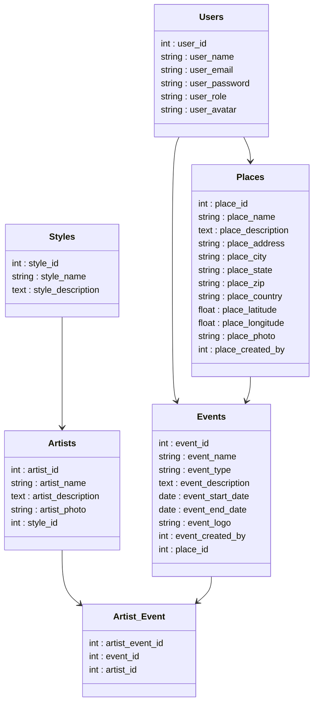

# BeatMap

### Setup the API

---

To setup the api, follow these steps :
1. Clone this repo wherever you want.
2. Create a .env file to link it to your database.
3. In a terminal, run thoose command :
- `composer install`
- `php artisan storage:link`
- `php artisan migrate:fresh --seed`
4. Extract the images.zip in the root folder of the API.
5. Enjoy !

### ER Model

---

